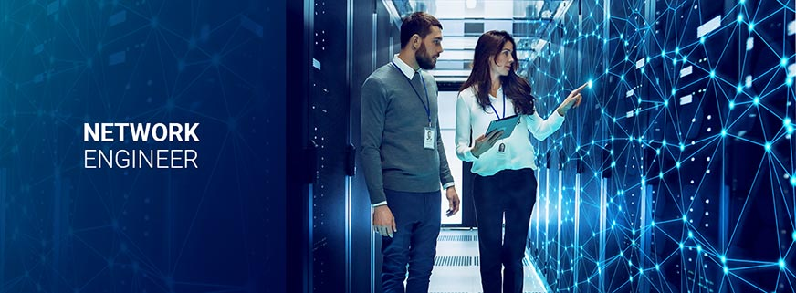
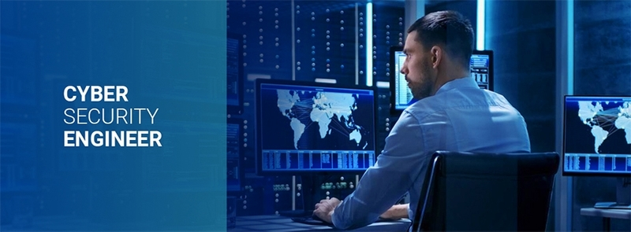

# {{ title }}
## Network Engineer
Network engineers are responsible for designing, building, and automating network infrastructures. These include local area networks (LANs), wide area networks (WANs), and intranets. Their goal is to ensure the connectivity of network systems.

<figure>
  
  <figcaption>Image from <a href="https://www.fieldengineer.com/skills/what-is-a-network-engineer">Network Engineer - Field Engineer</a></figcaption>
</figure>

Network engineers find ways to improve and optimize network infrastructure. 

Network engineers monitor and troubleshoot network systems to ensure they run well. They analyze network performance and test network functionality.

Some responsiblilites of Network Engineers:

- Designing, deploying, maintaining, and troubleshooting networks
- Analyzing and monitoring network traffic
- Implement performance optimization to network systems
- Configure network systems and network equipment
- Ensure the connectivity of network systems

Network engineers may share some responsibilities as network administrators. Network engineers focus on designing and building networks. Network administrators maintain and manage them.

## Cybersecurity Engineer
Cybersecurity engineers are responsible to build and maintain systems that are secure from cyberattacks.

<figure>
  
  <figcaption>Image from <a href="https://www.fieldengineer.com/skills/who-is-a-cyber-security-engineer">Cyber Security Engineer - Field Engineer</a></figcaption>
</figure>

They focus on fixing and protecting these systems. They stay up to date on new technologies so they can keep their systems secure. 

Cybersecurity engineers build an emergency plan with the IT team to get things up and running quickly following a disaster.

Some responsibilities of Cybersecurity Engineers:

- Protect systems by implementing new solutions and technologies
- Defining, implementing, and maintaining corporate security policies
- Configure and install firewalls and intrusion detection systems
- Supervise changes in software, hardware, and user needs
- Recommend modifications in legal, technical, and regulatory areas

Certifications for Network Engineers:

- CCNA (Recommended)
- CompTIA Network+

Certifications for Cybersecurity Engineers:

- CompTIA Security+ (Recommended)
- CompTIA Network+

### Should I be a Network Engineer or Cybersecurity Engineer?
You should be a Network Engineer if you are interested in the technical details of network systems. You have to design and configure network systems as a Network Engineer.

You should be a Cybersecurity Engineer if you are interested in the practice of securing and protecting systems. You have to secure and maintain systems as a Cybersecurity Engineer.

## Resources
- [Become a network engineer - Cisco](https://www.cisco.com/site/us/en/learn/training-certifications/tech-roles/network-engineer.html)
- [Your Next Move: Network Engineer - CompTIA](https://www.comptia.org/en-us/blog/your-next-move-network-engineer/)
- [Your Next Move: Cybersecurity Engineer - CompTIA](https://www.comptia.org/en-us/blog/your-next-move-cybersecurity-engineer/)
- [What is cybersecurity?- Cisco](https://www.cisco.com/site/us/en/learn/topics/security/what-is-cybersecurity.html)
- [Network+ - CompTIA](https://www.comptia.org/en-us/certifications/network/#career-path)
- [Security+ - CompTIA](https://www.comptia.org/en-us/certifications/security/#career-path)
- [CCNA - Cisco](https://www.cisco.com/site/us/en/learn/training-certifications/certifications/enterprise/ccna/index.html)